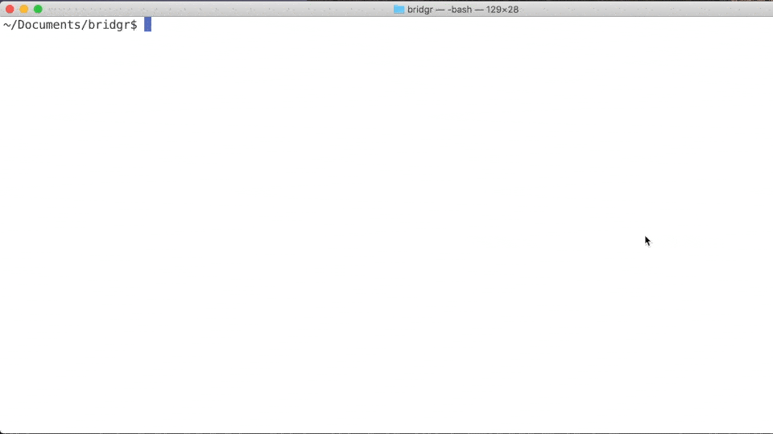

 # Bridgr

> Bridging the air-gap for your artifacts

[![Gitpod Ready-to-code][gitpod-image]][gitpod-url]

[![Build Status][travis-image]][travis-url]
[![Release Date][releasedate-image]][gh-dl-url]
[![Release Version][releasever-image]][gh-dl-url]
[![Downloads Stats][gh-downloads]][gh-dl-url]
[![GitHub][license]][license-url]
[![Go Report Card][reportcard-image]][reportcard-url]
[![codecov][codecov-image]][codecov-url]
[![Get more details at **codescene.io**.][codescene-image]][codescene-url]

Projects that need to build and/or deploy to air-gapped networks frequently run into a problem: All of the artifacts needed to build
your software (or deploy it) isn't available! The common solution to this problem has been to have each developer bring in the
pieces they need. Governance of the artifacts becomes nearly non-existant - at best you have a "dumping ground" of files that no one
person knows much about.

Bridgr helps bring order to the chaos by allowing a single, YAML manifest file to define all input artifacts to your system. With this
in place Bridgr can allow:

- CM control of artifacts - without necessarily needing the space to physically store them
- DevOps and pipeline friendly-ness
- Review of changes to artifacts by security teams or CM _before_ the artifact makes it to the target network
- Static website hosting of artifacts on the target network (with metadata, so repositories like YUM and Rubygems work)
- Support for multiple output formats - local filesystem, object storage, DVD image(?)

For more background and explanation of the use case for Bridgr, please see the [narrative](NARRATIVE.md).

Below is an example of Bridgr running and creating a YUM repository, downloading some files, and exporting docker images.
The file listings at the end show the artifacts created, including YUM metadata.



## Installation

Simply download the appropriate architecture binary from the [releases](releases) page, and execute it from wherever you want.

## Usage example

By default, Bridgr will create a `packages` directory with all artifacts gathered in the "current working directory" where you execute Bridgr.

Also by default, Bridgr will look for a `bridge.yml` manifest file in the directory where it is being run. This can be overridden with the `-c` option to bridgr to specify a configuration file elsewhere.

```shell
./bridgr -c path/to/another/bridge.yml
```

To only run one of the repository types, simply give that type after any configuration options. As an example, to only run the Files type, execute Bridgr like this:

```shell
./bridgr -v files
```

Additional command line options include:

| Option         | Meaning                                                                                                                                             |
| -------------- | --------------------------------------------------------------------------------------------------------------------------------------------------- |
| -v / --verbose | Verbose Output                                                                                                                                      |
| -n / --dry-run | Dry-run. Only do setup, don't fetch artifacts                                                                                                       |
| -c / --config  | Specify an alternate configuration file                                                                                                             |
| --version      | Print the version of Bridgr and exit. The output of stderr can be redirected to /dev/null to get just the version string.                           |
| -H / --host    | Run Bridgr in "hosting" mode. This mode does no downloading of artifacts, but makes Bridgr into a simple HTTP server. See `Hosting` for more detail |
| -l / --listen  | The listen address for Bridgr in hosting mode. This is only effective when coupled with the `-H` flag. Default is `:8080`                           |

### Artifacts requiring authentication

Bridgr support getting authenticated artifacts for `Files`, `Docker` and `Git`. Sensitive credential information is passed to Bridgr with environment variables. It does not support putting credentials in the configuration file because it risks users comitting these credentials into version control. Bridgr intends to promote good credential hygene.

Providing credentials follows a pattern of environment variable naming

- Username -> `BRIDGR_[HOST]_USER`
- Password -> `BRIDGR_[HOST]_PASS`
- API Token -> `BRIDGR_[HOST]_TOKEN`

Only one of Password or Token can be given. If both are provided, token will override.

The `[HOST]` portion of the environment variable above should be the hostname of the URL being fetched, converted to uppercase and `.` replaced with `_`. This is most easily shown with examples.

Fetching authentication protected docker hub image:

```shell
BRIDGR_DOCKER_IO_USER=user BRIDGR_DOCKER_IO_PASS=secret bridgr docker
```

In this case we have provided a username (user) and password (secret) for the default docker registry (docker.io). When the docker worker is run, and any images are specified from docker.io, bridgr will look for these two variables for credential information.

Another example for files:

```shell
BRIDGR_PROTECTED_MYSERVER_COM_USER=user BRIDGR_PROTECTED_MYSERVER_COM_PASS=secret bridgr files
```

And, finally for git - but this time showing a token (typical with Github and Gitlab):

```shell
BRIDGR_GITHUB_COM_TOKEN=abcdefg123456789 bridgr git
```

In this case, we don't need to specify the `_USER` part of the credential, because the git worker assumes a username of `git`, and Github or Gitlab just need it to _not_ be blank. The worker does this for you.

## Hosting mode

Once artifacts have been gathered by Bridgr and moved across the air-gap, it is required that there be an HTTP server available to the network for serving out these artifacts. In the absense of having an existing server available, Bridgr can itself act as a simple HTTP server. When run in "hosting" mode (`-H` command line option) Bridgr will not fetch
any artifacts or look for a manifest file, but will only serve out static files from the `packages` directory where it is executed. When hosting mode is combined with the `--verbose` option, Bridgr will write HTTP logs to stdout in [Combined Log Format](http://httpd.apache.org/docs/current/logs.html#accesslog). If you desire logs be written to a file, then you are responsible for redirecting stdout to the appropriate file in your shell.

Note, that there is no complex configuration available to Bridgr in hosting mode. If you require SSL/TLS for your artifacts, then you must use another product. A containerized Nginx server would be one option, for example. Likewise, there is no authentication for artifacts in hosting mode.

However, if you need a quick-and-dirty HTTP server or as a proof-of-concept Bridgr can meet that need.

An example of running Bridgr for a long term HTTP hosting mode

```shell
nohup ./bridgr -H -v &>/var/log/bridgr &
```

You may also create a systemd service file and be able to control Bridgr as an OS service.

## Development setup

Requires Go version 1.11 or higher.

Bridgr uses Go modules available since GoLang 1.11 release. To do development on Bridgr, simply clone this repository to your preferred location
and run `make`. This will download all dependencies using the controlled go modules configuration. You must have go properly installed and configured on your system first.

Some handy make targets to help with development:

| Target   | Meaning                                                            |
| -------- | ------------------------------------------------------------------ |
| test     | Run the unit tests                                                 |
| coverage | Run the unit tests, and open a browser to show the coverage report |
| download | Only download the module dependencies                              |
| generate | Only generate the templated files to be bundled in the binary      |

The default target is to build the bridgr binary. It will create a binary named `bridgr` in the root of the repository.

### Dependencies to use

Using new (as of go 1.11) [modules-style](https://github.com/golang/go/wiki/Modules) dependencies.
Project structure following [these guidelines](https://github.com/golang-standards/project-layout)
Example project showing [CI pipeline](https://gitlab.com/pantomath-io/demo-tools)

Significant Go modules used by `Bridgr`:

- go-git
- docker.io/go-docker
- yaml.v3
- vfsgen

Potential for schema definition/validation of the YAML config file: [https://github.com/rjbs/rx](https://github.com/rjbs/rx)
Potential library for creating iso9660 (ISO) files [https://github.com/kdomanski/iso9660](https://github.com/kdomanski/iso9660)

## Release History

- 1.3.0
  - Add authentication support
  - Update to Go version 1.13
- 1.2.1
  - Fixes for usability bugs
- 1.2.0
  - Bridgr is now itself a static HTTP server (use the `-H` option flag)
  - Added Git repo cloning support
  - Added Rubygem repo creation
  - Built against Go version 1.12
- 1.1.0
  - Add PyPi support
- 1.0.0
  - Intial release of Bridgr with support for Yum, Files, and Docker artifacts
- 0.0.1
  - Work in progress

## Meta

Ian Martin – ian@imartin.net

Distributed under the MIT license. See `LICENSE` for more information.

[https://github.com/aztechian/bridgr](https://github.com/aztechian/)

## Contributing

1. [Fork it](https://github.com/aztechian/bridgr/fork)
2. Create your feature branch (`git checkout -b feature/fooBar`)
3. Commit your changes (`git commit -am 'Add some fooBar'`)
4. Push to the branch (`git push -u origin HEAD`)
5. Create a new Pull Request

<!-- Markdown link & img dfn's -->

[gh-downloads]: https://img.shields.io/github/downloads/aztechian/bridgr/total.svg
[gh-dl-url]: releases/
[license]: https://img.shields.io/github/license/aztechian/bridgr
[license-url]: LICENSE
[travis-image]: https://img.shields.io/travis/aztechian/bridgr
[travis-url]: https://travis-ci.org/aztechian/bridgr
[wiki]: https://github.com/aztechian/bridgr/wiki
[reportcard-image]: https://goreportcard.com/badge/github.com/aztechian/bridgr
[reportcard-url]: https://goreportcard.com/report/github.com/aztechian/bridgr
[codecov-image]: https://codecov.io/gh/aztechian/bridgr/branch/master/graph/badge.svg
[codecov-url]: https://codecov.io/gh/aztechian/bridgr
[codescene-image]: https://codescene.io/projects/4859/status.svg
[codescene-url]: https://codescene.io/projects/4859/jobs/latest-successful/results
[releasedate-image]: https://img.shields.io/github/release-date/aztechian/bridgr?color=blueviolet
[releasever-image]: https://img.shields.io/github/v/release/aztechian/bridgr
[gitpod-url]: https://gitpod.io/#https://github.com/aztechian/bridgr
[gitpod-image]: https://img.shields.io/badge/Gitpod-Ready--to--Code-blue?logo=gitpod
